# *ESSE REPO VAI VIRAR PRIVADO DEPOIS*

# Escopo de Produto — CRM Interno (KCRM)

**Status:** Rascunho v0.1 · **Autor:** Felipe Ortiz · **Data:** 12/08/2026 **Objetivo do documento:** alinhar visão, escopo do MVP e decisões arquiteturais antes do início do desenvolvimento.

---

## 1. Visão

Construir um CRM próprio para uso interno, mas **arquitetado desde o dia 1 para se tornar um produto comercial multi-cliente**. O foco é resolver as dores internas que não são atendidas pelos CRMs testados internamente como: Visão financeira que separe receita recorrente (MRR) de pagamentos únicos e comissionamento por vendedor.

> **Princípio norteador:** construir _interno-primeiro, comercial-pronto_. Toda decisão de dados, permissão e infraestrutura assume múltiplos clientes desde o início, mesmo enquanto houver apenas um.

## 2. Problema

Depois de um tempo de experiência com os principais CRMs do mercado concluímos que alguns detalhes únicos a Krolik não estavam sendo preenchidos, alem de alguns detalhes mais aparentes.

O CRM atual (**Agendor**) é inadequado para o ciclo de vendas complexo da empresa. Alternativas avaliadas também não resolvem:

| Ferramenta | Situação   | Motivo                                                                                            |
| ---------- | ---------- | ------------------------------------------------------------------------------------------------- |
| Agendor    | Em uso     | Ver limitações abaixo                                                                             |
| PipeRun    | Descartada | Funcional, porém cara (~R$130/usuário)                                                            |
| Pipedrive  | Descartada | Muito caro                                                                                        |
| RD Station | Descartada | Muito caro                                                                                        |
| Chat Label | Referência | Separa produtos por ciclo de cobrança, mas **não** oferece relatórios que segmentem MRR × pontual |

**Limitações centrais que motivam o projeto:**

1. **Relatórios financeiros** — MRR e pagamentos únicos são consolidados, impossibilitando acompanhar vendas recorrentes com precisão e calcular comissões.
2. **Lacuna do mercado** — mesmo quem separa produtos por ciclo (Chat Label) falha no mesmo ponto: **não há camada de relatório** que segmente as categorias. Essa é a oportunidade que diferencia o produto.

## 3. Usuários e personas

| Persona              | Uso principal              | Necessidade-chave                                                                                                         |
| -------------------- | -------------------------- | ------------------------------------------------------------------------------------------------------------------------- |
| **SDR**              | Prospecção e qualificação  | Cadastro e associação inicial no funil simples e rápido (nome, telefone); repassar oportunidade ao Closer sem retrabalho. |
| **Closer**           | Negociação e fechamento    | Funil detalhado, geração de proposta, registro de produtos vendidos                                                       |
| **Gestor de vendas** | Acompanhamento e comissões | Relatórios MRR × pontual, cálculo de comissão, previsibilidade                                                            |
| **Marketing**        | Inteligência de mercado    | Volume de produtos vendidos (ex.: "1.000 ramais")                                                                         |
| **Admin**            | Configuração               | Gestão de usuários, funis, templates, permissões                                                                          |

## 4. Escopo do MVP (versão utilizável — meta ~2 meses)

O objetivo do MVP é **substituir o Agendor no dia a dia**, não entregar tudo. As duas features essenciais (propostas + financeiro) são obrigatórias, mas um CRM só é "utilizável" com o básico de pipeline funcionando.

### 4.1 Fundação (pré-requisito, não é feature visível)

- Cadastro detalhado de contatos e empresas.
- Estrutura de oportunidades (deal) com valor, produtos, estágio, responsável.
- Modelo de dados **multi-tenant** (ver §6).
- Autenticação e papéis básicos (SDR, Closer, Gestor, Admin).
- **Importação inicial do Agendor** (necessidade interna imediata; vira feature de onboarding comercial depois).

### 4.2 Geração de propostas

- Upload ou criação de **template personalizado** (PDF/Word) de proposta por organização, **preservando design e branding**.
- Geração automática de uma **página final** anexada a proposta, com dados do CRM (produtos, valores, endereço, etc.).

### 4.3 Relatórios financeiros (MRR × pontual)

- Cada produto/item carrega um **tipo de cobrança**: recorrente (mensal/anual) ou pontual(Encaixar reajuste anual em cima de impostos).
- Relatório que **segmenta receita recorrente de pagamentos únicos**.
- **Normalização de MRR:** definir regra para planos anuais (recomendo `valor_anual / 12` para o MRR, mantendo o valor cheio no contrato).
- Base para cálculo de comissão (a lógica de comissão em si pode começar manual/exportável e ser automatizada na Fase 2).

### 4.4 Gestão de oportunidades

- **Clonagem independente** de oportunidade, **incluindo anexos**, para transferência de funil (SDR → Closer).
    - _Nota de produto:_ clonar (em vez de mover) preserva o registro original do SDR para atribuição/métricas. Recomendo **vincular clone ↔ original** para não duplicar receita nos relatórios e ainda creditar ambos os vendedores.
- **Funis separados:** Cadastro funil simplificado do SDR (nome, telefone) e funil detalhado do Closer.

### 4.5 Fora do escopo do MVP

- Relatório de volume de produtos para marketing (Fase 2).
- Cálculo automatizado de comissões (Fase 2 — no MVP, exportar dados basta).
- Dashboards analíticos avançados.
- Substituição de variáveis dentro do template de proposta.
- Assinatura eletrônica de propostas.
- Recursos comerciais (white-label, billing, self-serve) — Fase 3.

## 5. Métricas de sucesso

- **Adoção interna:** 100% do time de vendas migrado do Agendor.
- **Confiabilidade financeira:** MRR e receita pontual reconciliam com o financeiro (meta: divergência < 1%).
- **Handoff SDR → Closer:** sem retrabalho de recadastro (0 dados reinseridos manualmente).

## 6. Decisões arquiteturais — interno → comercial

> Esta seção é a mais importante para a meta de escalabilidade. Cada item abaixo é barato de acertar agora e caro de corrigir depois.

1. **Multi-tenancy desde o dia 1.** Isolamento de dados por organização (tenant), mesmo com um único cliente hoje. Migrar de single-tenant para multi-tenant depois costuma ser reescrita.
2. **RBAC (papéis e permissões)** desde o início: SDR, Closer, Gestor, Admin — e prever papéis customizáveis por organização no futuro.
3. **LGPD.** O CRM guarda dados pessoais (PII). Prever consentimento, exportação, exclusão e log de auditoria já na modelagem.
4. **Importação/migração como capability, não script.** O import do Agendor é necessidade interna imediata evitando retrabalho para cadastro dos leads.

## 7. Riscos e questões em aberto

**Questões para fechar antes do desenvolvimento:**

- Qual o **volume esperado** de organizações/usuários no cenário comercial? (dimensiona multi-tenancy e infra)
- O CRM **calcula comissão** internamente ou **integra com o financeiro**? Quem é a fonte da verdade?
- **Integrações necessárias** no nosso cenário: telefonia/VoIp, WhatsApp, e-mail? Alguma é bloqueante para nosso MVP?
- Regra de **normalização de MRR** para planos anuais.
- **Assinatura de proposta** (ex.: Clicksign/DocuSign) entra em que fase?

**Riscos:**

- **Prazo de ~2 meses é agressivo.** Se surgir pressão, o corte deve preservar as duas features essenciais + pipeline básico; o resto desce de fase.
- **Dupla contagem de receita** na clonagem SDR→Closer se o vínculo clone↔original não for tratado.

## 8. Faseamento sugerido

| Fase                        | Entrega                                                                                  | Foco                  |
| --------------------------- | ---------------------------------------------------------------------------------------- | --------------------- |
| **Fase 0 — Fundação**       | Multi-tenancy, auth/RBAC, modelo de dados, import Agendor                                | Base comercial-pronta |
| **Fase 1 — MVP (~2 meses)** | Pipeline, funis SDR+Closer, clonagem, geração de proposta, relatório MRR × pontual       | Substituir o Agendor  |
| **Fase 2 — Inteligência**   | Contabilidade de comissões automatizadas, relatório de produtos p/ marketing, dashboards | Precisão e insights   |
| **Fase 3 — Comercial**      | White-label, billing/assinaturas, onboarding self-serve, planos                          | Go-to-market          |

## 9. Entidades

```mermaid
classDiagram
    %% --- CLASSES CORE (AZUL) ---
    class Negociacao {
        +UUID id
        +String titulo*
        +String status ABERTA, GANHA, PERDIDA
        +UUID idFunil*
        +UUID idEtapa*
        +UUID idResponsavel* <<O DONO PRINCIPAL AINDA FICA AQUI>>
        +UUID idCliente*
        +JSONB dadosPersonalizados
        +DateTime dataFechamentoEsperada
        +DateTime criadoEm
        +String criadoPor
        +ganhar()
        +perder(String idMotivo)
        +alterarTitulo(String titulo)
        +alterarResponsavel(String idResponsavel)
        +alterarFunil(String idFunil)
        +alterarEtapa(String idEtapa)
    }

    class Contato {
        +UUID id
        +String nome*
        +String whatsapp*
        +String telefone unico
        +String email unico
        +String cpf unico
        +String cargo
        +UUID idEmpresa
        +JSONB dadosPersonalizados
        +Boolean ativo
        +ativar()
        +desativar()
        +atualizar(Contato dados)
    }

    class Empresa {
        +UUID id
        +String razaoSocial*
        +String nomeFantasia
        +String cnpj* unico
        +String telefone
        +JSONB dadosPersonalizados
        +Boolean ativo
        +ativar()
        +desativar()
        +atualizar(Empresa dados)
    }

    class Produto {
        +UUID id
        +String codigo* unico
        +String nome*
        +String descricao
        +Decimal precoBase
        +Decimal custoBase
        +Cobranca cobranca ASSINATURA, AVULSO
        +Boolean ativo
        +ativar()
        +desativar()
        +atualizar(Produto dados)
    }

    %% --- CLASSES FINANCEIRAS (VERDE) ---
    class ItemNegociacao {
        +UUID id
        +UUID idNegociacao*
        +UUID idProduto*
        +Int quantidade*
        +Decimal precoUnitario* 
        +Decimal custoUnitario* 
        +Decimal valorDesconto
        +String modeloCobranca UNICO, RECORRENTE
        +atualizar(ProdutoOmitindoIds dados)
    }

    class ComissaoItem {
        +UUID id
        +UUID idItemNegociacao*
        +UUID idUsuario*
        +String papel VENDEDOR, SDR
        +Decimal percentual*
        +Decimal valorR$*
        +DateTime criadoEm
        +atualizar(ComissaoItemOmitindoIdNegociacao dados)
    }

    class PacoteComissao {
        +UUID id
        +String nome*
        +String descricao
        +Boolean ativo
    }

    class RegraComissaoProduto {
        +UUID idPacote*
        +UUID idProduto*
        +Decimal percentual*
    }

    class ParticipanteNegociacao {
        +UUID idNegociacao*
        +UUID idUsuario*
        +String papel* VENDEDOR, SDR, GERENTE
    }

    %% --- CLASSES IAM / ACESSO (ROXO) ---
    class Usuario {
        +UUID id
        +String nome*
        +String email* unico
        +String telefone
        +UUID idPacoteComissao*
        +UUID idPerfil*
        +Boolean ativo
        +ativar()
        +desativar()
        +alterarPerfil(String idPerfil)
        +atualizarSenha(String novaSenha)
        +atualizarNome(String novoNome)
        +atualizarTelefone(String novoTelefone)
        +vincularPacoteComissao(String idPacote)
    }

    class Perfil {
        +UUID id
        +String nome*
        +Boolean ativo
        +atualizar(String novoNome)
    }

    class Permissao {
        +UUID id
        +String modulo*
        +String acao*
    }

    class PermissaoPerfil {
        +UUID idPerfil
        +UUID idPermissao
    }

    %% --- CLASSES OPERACIONAIS (LARANJA) ---
    class Tarefa { 
        +UUID id
        +String tipo* 
        +String status* 
        +String prioridade*
        +DateTime dataVencimento*
        +DateTime concluidoEm
        +UUID idNegociacao
        +UUID idContato
        +UUID idResponsavel*
        +UUID idCriador*
        +marcarComoConcluido()
        +alterarResponsavel(String idResponsavel)
        +alterarPrioridade(String idPrioridade)
        +alterarTipo(String idTipo)
        +reagendar(DateTime novaDataVencimento)
    }

    class Nota {
        +UUID id
        +Text content*
        +UUID idNegociacao*
        +UUID idCriador*
        +DateTime criadoEm
        +atualizar(Text content)
    }

    class HistoricoAtividade {
        +UUID id
        +UUID idNegociacao*
        +UUID idUsuario*
        +String tipoAcao* MUDOU_ETAPA, NOTA_CRIADA
        +JSONB detalhes*
        +DateTime criadoEm
    }

    class Proposta {
        +UUID id
        +String descricao*
        +UUID idNegociacao*
        +UUID idModelo* 
        +String status ENVIADA, ACEITA, CANCELADA
        +DateTime dataEnvio
        +DateTime dataValidade
        +Boolean ativo
        +aceitar()
        +cancelar()
        +reagendar()
    }

    class PropostaModelo {
        +UUID id
        +String name*
        +JSONB camposVariaveis
        +Text conteudoHTML*
        +Boolean ativo
    }

    %% --- CLASSES ESTRUTURAIS (CINZA) ---
    class Funil {
        +UUID id
        +String nome*
        +String descricao
        +Boolean ativo
        +atualizar(Funil dados)
    }

    class Etapa {
        +UUID id
        +String nome*
        +String descricao
        +Int ordem*
        +UUID idFunil*
        +Boolean ativo
        +atualizar(EtapaNomeDescricaoOrdem dados)
        +deletar()
    }

    class CampoPersonalizado {
        +UUID id
        +String nome*
        +String descricao
        +String alvo Contato, EMPRESA, NEGOCIACAO
        +String tipo TEXTO, NUMERO, LISTA
        +Boolean ativo
        +atualizar(CampoPersonalizado dados) 
    }

    class Etiqueta {
        +UUID id
        +String name*
        +String color*
        +Boolean ativo
        +atualizar(Etiqueta dados) 
    }

    class Origem {
        +UUID id
        +String name*
        +Boolean ativo
        +atualizar(String nome)
    }

    class MotivoDePerda {
        +UUID id
        +String name*
        +Boolean ativo
        +atualizar(String nome)
    }

    %% --- RELACIONAMENTOS REORGANIZADOS PARA LAYOUT ---
    
    %% Core & Estrutural
    Funil "1" *-- "*" Etapa : possui
    Etapa "1" <-- "*" Negociacao : estagio atual
    Origem "1" <-- "*" Negociacao : veio de
    MotivoDePerda "1" <-- "*" Negociacao : perdeu por
    Empresa "1" <-- "*" Negociacao : cliente
    Empresa "1" <-- "*" Contato : trabalha em

    %% Negociacao e Operacional
    Negociacao "1" *-- "*" Tarefa : tem
    Negociacao "1" *-- "*" Nota : tem
    Negociacao "1" *-- "*" HistoricoAtividade : sofreu
    Negociacao "1" *-- "*" Proposta : possui
    PropostaModelo "1" <-- "*" Proposta : baseada em

    %% Dependência de JSONB e N:N
    Negociacao ..> CampoPersonalizado : utiliza schema
    Contato ..> CampoPersonalizado : utiliza schema
    Empresa ..> CampoPersonalizado : utiliza schema
    Negociacao "*" -- "*" Etiqueta : possui
    Contato "*" -- "*" Etiqueta : possui
    Empresa "*" -- "*" Etiqueta : possui
    
    %% Financeiro e Comissões
    Negociacao "1" *-- "*" ItemNegociacao : contem itens
    Negociacao "1" *-- "*" ParticipanteNegociacao : possui equipe
    Produto "1" <-- "*" ItemNegociacao : referente a
    ItemNegociacao "1" *-- "*" ComissaoItem : gera fatia
    PacoteComissao "1" *-- "*" RegraComissaoProduto : possui regras
    Produto "1" <-- "*" RegraComissaoProduto : alvo da regra
    
    %% IAM e Vínculos
    Usuario "1" <-- "*" Negociacao : dono
    Usuario "1" <-- "*" ParticipanteNegociacao : membro
    Usuario "1" <-- "*" ComissaoItem : favorecido
    PacoteComissao "1" <-- "*" Usuario : utiliza
    Perfil "1" <-- "*" Usuario : possui
    Perfil "1" *-- "*" PermissaoPerfil : contem
    Permissao "1" *-- "*" PermissaoPerfil : pertence

    %% --- CORES APLICADAS (USANDO STYLE) ---
    
    %% Azul
    style Negociacao fill:#e3f2fd,stroke:#1565c0,stroke-width:2px,color:#000
    style Empresa fill:#e3f2fd,stroke:#1565c0,stroke-width:2px,color:#000
    style Contato fill:#e3f2fd,stroke:#1565c0,stroke-width:2px,color:#000
    style Produto fill:#e3f2fd,stroke:#1565c0,stroke-width:2px,color:#000

    %% Verde
    style ItemNegociacao fill:#e8f5e9,stroke:#2e7d32,stroke-width:2px,color:#000
    style ComissaoItem fill:#e8f5e9,stroke:#2e7d32,stroke-width:2px,color:#000
    style PacoteComissao fill:#e8f5e9,stroke:#2e7d32,stroke-width:2px,color:#000
    style RegraComissaoProduto fill:#e8f5e9,stroke:#2e7d32,stroke-width:2px,color:#000
    style ParticipanteNegociacao fill:#e8f5e9,stroke:#2e7d32,stroke-width:2px,color:#000

    %% Roxo
    style Usuario fill:#f3e5f5,stroke:#7b1fa2,stroke-width:2px,color:#000
    style Perfil fill:#f3e5f5,stroke:#7b1fa2,stroke-width:2px,color:#000
    style Permissao fill:#f3e5f5,stroke:#7b1fa2,stroke-width:2px,color:#000
    style PermissaoPerfil fill:#f3e5f5,stroke:#7b1fa2,stroke-width:2px,color:#000

    %% Laranja
    style Tarefa fill:#fff3e0,stroke:#ef6c00,stroke-width:2px,color:#000
    style Nota fill:#fff3e0,stroke:#ef6c00,stroke-width:2px,color:#000
    style HistoricoAtividade fill:#fff3e0,stroke:#ef6c00,stroke-width:2px,color:#000
    style Proposta fill:#fff3e0,stroke:#ef6c00,stroke-width:2px,color:#000
    style PropostaModelo fill:#fff3e0,stroke:#ef6c00,stroke-width:2px,color:#000

    %% Cinza
    style Funil fill:#f5f5f5,stroke:#616161,stroke-width:2px,color:#000
    style Etapa fill:#f5f5f5,stroke:#616161,stroke-width:2px,color:#000
    style CampoPersonalizado fill:#f5f5f5,stroke:#616161,stroke-width:2px,color:#000
    style Etiqueta fill:#f5f5f5,stroke:#616161,stroke-width:2px,color:#000
    style Origem fill:#f5f5f5,stroke:#616161,stroke-width:2px,color:#000
    style MotivoDePerda fill:#f5f5f5,stroke:#616161,stroke-width:2px,color:#000
```

